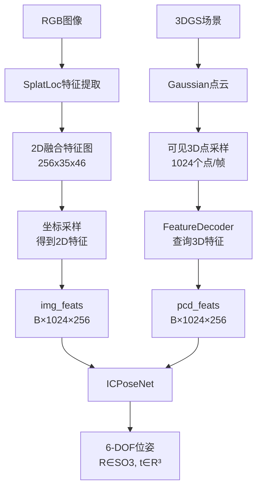

# ICLPose 项目架构概述

## 1. 项目目标
**输入**: RGB图像 + 3DGS场景 → **输出**: 相机6-DOF位姿 (旋转+平移)

---

## 2. 整体数据流



---

## 3. 特征提取流程

### 3.1 2D图像特征 (预提取) - **DINO+StableDiffusion融合特征**
```
RGB图像 (640×480×3)
    ↓ DINO backbone + StableDiffusion decoder
融合特征图 (256×35×46)  # 已预提取保存在 fused_feat/
    ↓ 根据投影坐标采样
2D特征 (1024×256)      # 运行时bilinear采样
```

**关键文件**: `fused_feat/fused_feat_xxxx.npy`
**特征说明**: DINO提供语义特征，SD提供细粒度视觉特征，融合后具有强语义+几何区分能力

### 3.2 3D点云特征 (运行时) - **FeatureDecoder查询**
```
Gaussian点云 (417758×3)
    ↓ 视锥裁剪 + 随机采样
可见点 (1024×3)
    ↓ FeatureDecoder
3D特征 (1024×256)
```

**关键模块**: `FeatureDecoder` (冻结)

---

## 4. 模型架构 (ICPoseNet)

```
输入:
  img_feats: (B, 1024, 256)  # 2D特征
  pcd_feats: (B, 1024, 256)  # 3D特征
  img_pixels: (B, 1024, 2)   # 2D坐标
  pcd_points: (B, 1024, 3)   # 3D坐标

Query Embeddings: (1, 64, 256)  # 可学习

CrossModalFusion (2层):
  Layer 1: SelfAttn → CrossAttn(Query, Image)
  Layer 2: SelfAttn → CrossAttn(Query, PointCloud)

输出分支:
  1. Keypoint Heatmap: softmax(query @ img.T / temp)
  2. 2D Keypoints: heatmap @ img_pixels  # soft-argmax
  3. 3D Keypoints: heatmap @ pcd_points
  
PoseRegressor:
  [kp_2d_embed, query_feat, kp_3d_embed] → 6-DOF位姿
```

---

## 5. 损失函数

| 损失 | 描述 | 权重 |
|-----|------|------|
| **Rotation (geodesic)** | 测地线旋转误差 | 1.0 |
| **Translation (L2)** | 平移向量距离 | 1.0 |
| **Diversity** | 防止keypoints聚集 | 0.05 |
| **Reprojection** | 2D-3D几何一致性 | 0.1 |

---

## 6. 当前配置 (exp022)

| 参数 | 值 |
|-----|-----|
| num_queries | 64 |
| feature_dim | 256 |
| fusion_layers | 2 |
| attention_temperature | 8.0 |
| 采样点数 | 1024/帧 |
| batch_size | 32 |
| learning_rate | 1e-4 |

---

## 7. 当前问题

**热力图均匀**: softmax在1024点上分布平滑，无法形成尖锐的置信度峰值

**可能原因**: temperature=8.0仍太大，或需要top-k机制
