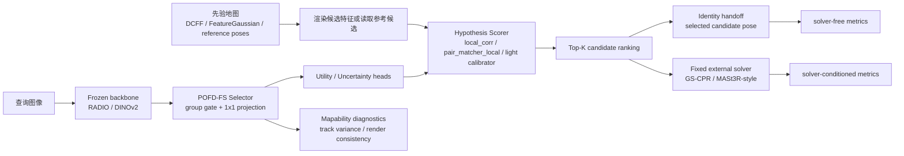
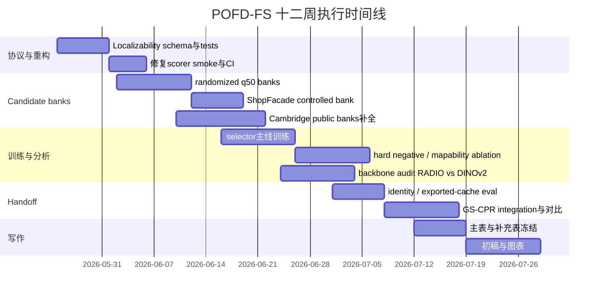

# 从基础视觉模型特征选择到基于先验地图定位的 POFD-FS 研究报告

## 执行摘要

结合近八年代表性文献与当前 `radio` 分支现状，我建议把项目明确重构为一个**特征中心**而非**求解器中心**的问题：主问题不再是“连续位姿优化是否再提升一点”，而是“冻结基础视觉模型的哪些子空间真正**可定位**，并且能以更小、更稳定、更可解释的方式服务地图先验定位”。这一重构与文献脉络一致：AnyLoc、SALAD、Revisit Anything 显示 foundation features 在 **place retrieval** 上很强，但 LoFTR、MASt3R、DeViLoc、NeRFMatch、STDLoc、GS-CPR 等工作都表明，想把特征真正变成 **correspondence** 或 **refinement** 能力，必须引入几何约束、跨图匹配或 3D feature field；你的仓库当前证据也表明瓶颈在 **candidate scoring / selector**，不是 downstream refiner 本身。最可行、也最容易形成强 claim 的路线，是把论文主线写成：**POFD-FS = compact, mapable, solver-aware foundation feature selection for hypothesis localizability**，并采用**solver-free** 与 **solver-conditioned** 双协议评估，而不是把 GS-CPR/LoFTR/MASt3R 式 refiner 当作主方法。citeturn23search2turn13search1turn34search2turn33search1turn8search12turn20search1turn8search10turn24search1turn30view0turn31view0turn37view0

## 文献脉络与关键工作

先给出本文采用的四类定位范式。**场所检索**指先从图库/参考视角中检索 top-K 候选；**候选评分**指直接对离散 pose hypothesis 或 reference pose 排序；**对应建立**指产生 2D-2D / 2D-3D 对应后交给 PnP/RANSAC；**连续优化**则是通过可微渲染、分析-合成或 feature-metric 对 pose 做局部细化。多数强方法是混合范式，而你当前 POFD-FS 最适合落在“**候选评分为主，solver-conditioned 作为外层验证**”这一位置。citeturn9search22turn9search14turn24search1turn31view0

### 检索、候选评分与位姿验证脉络

| 工作 |  venue / 范式 | 核心方法 | 优点 | 短板 | 与 POFD-FS 的直接关系 |
|---|---|---|---|---|---|
| **InLoc** citeturn0search0 | CVPR 2018；场所检索 → 稠密匹配 → 渲染验证 | 室内定位：先检索，再做 dense matching，最后用 synthesized view verification 提升鲁棒性 | 明确把“候选检索”和“候选验证”拆开；大视角/遮挡更稳 | 流水线较重，依赖高质量合成视图 | 直接启发 POFD-FS 的**两级协议**：先 ranking，再独立验证 |
| **Is This the Right Place? Geometric-Semantic Pose Verification** citeturn0search1 | ICCV 2019；候选评分 / 验证 | 结合几何与语义做 pose verification | 强调“验证”是独立子问题，而非求解器附属品 | 依赖语义与验证渲染质量 | 说明 POFD-FS 可以把**hypothesis scoring**写成一等公民 |
| **From Coarse to Fine: Robust Hierarchical Localization at Large Scale** / hloc 源头 citeturn9search22turn9search1 | CVPR 2019；场所检索 → 对应建立 | coarse retrieval 缩小搜索空间，再局部特征匹配估计姿态 | 速度、扩展性、模块化都很强；社区基线事实标准 | 对 retrieval 排名质量非常敏感 | 你的 reference-pose banks 应直接基于 hloc/NetVLAD top-K 构建 |
| **Investigating the Role of Image Retrieval for Visual Localization** citeturn9search14 | IJCV 2022；检索分析 | 系统研究 retrieval 对不同定位范式的影响 | 说明“检索好”≠“最终定位好” | 不直接给出新定位器 | 支持把 POFD-FS 主任务从检索转为**候选可定位性排序** |
| **Long-Term Visual Localization Revisited** 与 benchmark citeturn17search1turn17search2 | TPAMI 2022；基准 | 长期变化条件下统一评测 | 为 long-term / condition shift 提供标准评测框架 | 偏 benchmark，方法信息有限 | 你的 public reference-pose banks 应沿用其“跨条件”思路构造 |
| **AnyLoc** citeturn23search1turn23search3 | RA-L 2023 / ICRA 2024；场所检索 | 直接用 DINOv2 类 off-the-shelf features + 无监督聚合做通用 VPR | 跨域极强，证明 foundation feature 是 place recognition 的强底座 | 只解决 coarse place，不直接产生精确 pose | 证明 foundation features 对**检索**很强，但并不能替代 localization-aware scoring |
| **SALAD** citeturn13search1turn13search0 | CVPR 2024；场所检索 | 用 optimal transport 做局部特征聚合，引入 dustbin 丢弃无信息 patch | DINOv2 + 聚合设计很强，训练高效 | 仍是 VPR，不是 pose-hypothesis localizability | dustbin 思想可转成 POFD-FS 的**channel/spatial utility** |
| **Revisit Anything** citeturn12search1turn12search2 | ECCV 2024；场所检索 | 用 open-set segmentation 后的 image segments 做 partial place retrieval | 解决 whole-image descriptor 在部分重叠场景下失效的问题 | 仍偏 retrieval；需要分割先验 | 直接启发 POFD-FS 的**spatial utility mask**不应均匀对待整图 |
| **MeshVPR** citeturn15search1turn15search0 | ECCV 2024；场所检索 / rendered database | 在 city mesh 渲染图上做 VPR，并学习 real↔synthetic 对齐 | 很适合“先验地图不是实拍图库”的情形 | 仍主要是 coarse localization | 与你的 render-based candidate bank 思路高度一致 |
| **ImPosing** citeturn27search1turn27search4 | WACV 2023；候选评分 | 图像与 pose 一起编码到共同隐空间，对 image-pose pair 打分并分层细化 | 明确把定位写成 **score(query, pose)** | 与显式 3D 地图/feature field 结合较弱 | 是 POFD-FS 最直接的**任务形式先例**之一 |

这些工作共同说明：**place retrieval 已经很强，但 candidate utility / hypothesis localizability 仍是空档。** 这恰好是你的机会窗口。尤其是 AnyLoc、SALAD、Revisit Anything 都在说明“foundation features 的确强”，而 InLoc、Taira、ImPosing 与 hloc 则说明，仅有全局相似度并不足以完成可靠定位，仍需要候选验证、重排和结构化几何。citeturn23search2turn13search1turn12search1turn0search0turn0search1turn9search22turn27search1

### 对应建立、3D 特征场与渲染细化脉络

| 工作 | venue / 范式 | 核心方法 | 优点 | 短板 | 与 POFD-FS 的直接关系 |
|---|---|---|---|---|---|
| **HSCNet** citeturn11search2turn11search6 | CVPR 2020；对应建立 | 分层 scene coordinate classification + regression | scene-coordinate 路线的代表，能把 pose 变成像素到 3D 的映射 | 需要 scene-specific 训练 | 说明如果要直接走 2D-3D correspondence，需要强 scene supervision；POFD-FS 可避免此成本 |
| **Learning to Detect Scene Landmarks** citeturn11search1turn11search5 | CVPR 2022；对应建立 | 学 scene-specific landmarks，再用 landmark-to-3D 求 pose | 低存储、隐私友好、比较直接 | 强 scene-specific，泛化有限 | 和“选择更 mapable 的特征/landmark”高度相关 |
| **LoFTR** citeturn33search1turn33search0 | CVPR 2021 / TPAMI 2022；对应建立 | detector-free transformer matcher，做半稠密匹配 | 低纹理/重复纹理场景匹配鲁棒 | 需要成对图像 matching，不是直接 pose-hypothesis scorer | 表明 raw feature 不够，**cross-image matching** 才让 correspondence 成形 |
| **DeViLoc** citeturn8search12turn8search6 | CVPR 2024；对应建立 | 把 semi-dense 2D-2D matches 推断成 2D-3D correspondences | 在恶劣条件下对 sparse/noisy 3D map 更好 | 管线复杂，仍依赖 match quality | 说明 dense/semi-dense correspondence 的价值，但也说明这不是 raw feature 直接给出的能力 |
| **DUSt3R** citeturn2search20turn34search1 | CVPR 2024；对应建立 / 3D prior | 以 pointmap regression 做 3D understanding 与 matching 底座 | 对极端视角变化很稳 | 匹配精度不是最终最优 | 是 MASt3R、MUSt3R 等 3D-aware matcher 的底座 |
| **MASt3R** citeturn34search2turn34search0 | ECCV 2024；对应建立 | 在 DUSt3R 上加 local feature head + matching loss + 快速 reciprocal matching | 强鲁棒 + 更高精度，Map-free localization 显著提升 | 计算仍偏重 | 关键结论：**foundation 或 3D-aware features 要获得 correspondence 能力，需要额外匹配头与损失** |
| **CROSSFIRE** citeturn18search3turn25search1 | ICCV 2023；连续优化 / implicit feature field | 在隐式表示中学习 scene-specific self-supervised dense features 进行 relocalization | 说明 feature field 可替代纯 photometric alignment | 仍然偏 scene-specific map learning | 直接支持“scene-side feature field 可服务定位”，但也警示训练成本 |
| **The NeRFect Match / NeRFMatch** citeturn20search9turn20search0 | ECCV 2024；对应建立 | 利用 NeRF 内部特征做 2D-3D matching | 把 view synthesis 学到的内部表征用于匹配，Cambridge 上很强 | 依赖 NeRF 训练质量与 matching 设计 | 与“从 map representation 中抽 localization-usable feature”几乎同题 |
| **Feature 3DGS** citeturn5search0turn5search1 | CVPR 2024；3D feature field / distillation | 将 2D foundation features 蒸馏到 3DGS 的显式 feature field | render 快、可 prompt、可分割、利于多任务 | 论文主目标不是定位 | 是你 map-side“可渲染 feature field”最强可借鉴对象之一 |
| **NeRF-MAE** citeturn35search0turn35search1 | ECCV 2024；3D representation pretraining | 直接在 NeRF grid 上做自监督 3D 预训练 | 强调“3D-aware pretraining”让下游更强 | 不是定位论文 | 说明“mapable feature”可通过 3D 表征质量来衡量 |
| **GS-CPR** citeturn24search1turn24search0 | ICLR 2025；连续优化 / refinement | 基于 3DGS 渲染 RGBD，用 MASt3R 做 2D 匹配，测试时 refinement | 很强的外部 solver；对 indoor benchmark 尤其强 | 需要 coarse init，主贡献不是特征选择 | 最适合作为 POFD-FS 的**solver-conditioned 外部强基线** |
| **STDLoc** citeturn8search10turn8search7 | CVPR 2025；对应建立 | 基于 Feature Gaussian，做 matching-oriented Gaussian sampling + scene-specific detector + dense alignment | 不依赖 pose prior，完整 relocalization pipeline | 训练与场景建模都更重 | 说明 feature Gaussian 可以直接服务 6DoF pose，但代价是更强场景化设计 |
| **GPVK-VL** citeturn16search2turn16search6 | CVPR 2025；候选评分 / rendered keyframes | 基于几何保持的 virtual keyframes 扩展 viewpoint coverage | 大视角变化下显著更稳 | 更依赖 mesh/keyframe 合成 | 对你建设 reference-pose / rendered banks 的意义很大 |
| **GSFF** citeturn10search22turn3search7 | CVPR 2025；3D feature field / localization | 3DGS + 隐式 feature field，强调定位和隐私保护 | 直接面向 localization 的 3D feature field | 仍需 scene-specific field 学习 | 说明“mapable localization feature field”已开始成为单独问题 |
| **Feat2GS** citeturn4search6turn4search13 | CVPR 2025；foundation feature probing | 用 Gaussian Splatting probing VFMs 的几何/纹理 3D awareness | 为比较 RADIO、DINOv2 等提供非常自然的 probe 框架 | 不是定位论文 | 非常适合拿来做你的**backbone 选择实验** |
| **LoD-Loc v2** citeturn22search5turn22search3 | ICCV 2025；候选评分 / silhouette alignment | 在低 LoD 城市模型上做 coarse-to-fine pose cost volume 和显式轮廓对齐 | 强调 pose hypothesis scoring + cost volume 的威力 | 依赖建筑轮廓等特定先验 | 对你的“候选评分 / basin-aware ranking”建模很有借鉴意义 |

这一脉络非常清楚：**raw foundation features 本身通常不会天然给出高质量稀疏对应；它们要么被用作 retrieval substrate，要么要经过 geometry-aware matching head、scene-specific 3D field、或 render-and-match 机制才真正变成 localization signal。** MASt3R、LoFTR、NeRFMatch、STDLoc 分别从 matcher、3D grounding、NeRF/3DGS 场景表征等角度给出了同一结论。citeturn34search2turn33search1turn20search1turn8search10

### 与 POFD-FS 直接贴边但不宜作为主线替代的补充工作

| 工作 | venue | 为什么重要 | 为什么不应直接变成你的主线 |
|---|---|---|---|
| **PNeRFLoc** citeturn19search1turn19search3 | AAAI 2024 | 统一了 point-based representation、2D-3D matching 与 rendering-based refinement | 更像“新的完整定位器”，而不是特征选择 paper |
| **FaVoR** citeturn26search2turn26search1 | WACV 2025 | 渲染 sparse voxel descriptors 做 relocalization，非常贴近 handoff/refinement 设计 | 属于新的 scene representation 路线，会冲淡 POFD-FS 的 feature-selection claim |
| **SplatLoc** citeturn21search1turn10search13 | TVCG 2025 | 用 unbiased 3D descriptor field + 2D-3D feature matching 做 AR localization | 更像另起炉灶的 end-to-end map-and-localize |
| **GSplatLoc** citeturn10search20turn21search5 | arXiv 2024 | 把 keypoint descriptors grounding 到 3DGS，强调 coarse pose + fast localization | 很适合作为 engineering baseline，但当前不是顶会/顶刊主论据 |
| **GSFeatLoc** citeturn21search2 | arXiv 2025 | 直接“render synthetic RGBD → 2D-2D feature matches → lift → PnP” | 更适合当手边强 baseline，而不是论文主贡献 |
| **The Unreasonable Effectiveness of Pre-Trained Features for Camera Pose Refinement** citeturn38search0 | CVPR 2024 | 明确说明“预训练特征 + particle filter/renderable scene”就能很强地做 refinement | 适合拿来说明**外部 solver 很多，但你的主贡献不应是 solver 本身** |

文献对你最关键的结论只有两条。第一，**foundation features 的强项首先是 retrieval 和 coarse semantics，而不是直接的 geometry-calibrated sparse correspondences**；第二，**一旦要让它们服务精确定位，最自然的写法不是“再训练一个更强 solver”，而是“选择/压缩/规整出更 mapable、更可评分、更能进入 solver basin 的子空间”**。这正是 POFD-FS 应该占据的位置。citeturn23search2turn13search1turn34search2turn20search1turn24search1

## 面向 POFD-FS 的研究目标重构

### 基于当前仓库状态的客观判断

你现在的 `radio` 分支已经在事实上朝这个方向走了。仓库 README 明确写出当前最强 OldHospital 结果仍依赖 **oracle retrieval**，主部署瓶颈是 retrieval / candidate selection；而 real-init 下 top1 CLS 的中位平移误差约 **4.49 m**，top10 oracle 约 **2.79 m**，远大于 controlled oracle 情况。README 同时把主线组织成 `FeatureGaussian / SceneFeatureField / FeatureExtract / FeatureRetrieval / PoseRefine` 五个接口，并把最强几何评估路径放在 `pose_refine.evaluate_pipeline`。citeturn30view0

更关键的是，仓库里的项目计划文档已经明确写出：`radio` 分支应停止把自己呈现为“continuous camera pose refinement method”，而应转为 **POFD-FS: Pose-Observable Foundation Feature Selection**；核心任务从连续优化改成 **hypothesis utility / localizability ranking**；LoFTR、MASt3R、GS-CPR 等应被当作外部基线、teacher 或 stress-test，而非主方法。文档还给出了当前 controlled q10/q25/q50 结果：`pose-adapted + pair matcher r16` 已明显优于 raw RADIO 和 query-student，但 q50 仍只达到 `pred=0.223 m, top1=0.719, gap=0.093, Spearman=0.586`，接近但尚未越过既定 promotion threshold。citeturn31view0turn30view1

最近的 top-journal 计划文档又进一步把结果分成 **solver-free localizability** 与 **solver-conditioned localization** 两类，并且用 exported handoff cache 实测发现：当前“额外 render-LoFTR+PnP refinement”会在 q50 controlled cache 上**退化**，甚至 oracle top8 候选也会被它拉坏；因此当前最稳妥可部署的结果仍应是“**selected candidate pose = POFD top1**”。同一文档还显示，你已经具备 Cambridge 多场景的 HLoc/NetVLAD top10 reference-pose banks，但 naive pooled raw RADIO dense features 做 reranking **比 retrieval order 更差**，直接证明了“raw foundation feature similarity 并不等于 localization utility”。citeturn37view0

这意味着你之前的担心是对的，但只对了一半：**如果继续把项目写成“一个更强的连续 pose refinement solver”，确实会很乱，也不够优雅；但如果把它定性成“foundation features 的可定位性选择与评测框架”，你其实已经有了很好的起点。**citeturn31view0turn37view0

### 建议的主 claim

最适合投稿的主 claim 建议写成三层，层层递进：

1. **特征层 claim**：冻结 dense foundation features 中确实存在一个更 compact、更 mapable、对 pose hypothesis 更敏感的 localization subspace，而这个子空间并不是 raw cosine similarity 自动暴露出来的。这个 claim 由 AnyLoc/SALAD 的 retrieval 成果、MASt3R/LoFTR 的 matcher 成果，以及你当前 raw RADIO 在 public reference reranking 上失败的证据一起支撑。citeturn23search2turn13search1turn34search2turn33search1turn37view0

2. **排序层 claim**：在不改变地图构建方式、也不依赖 solver 内部训练的前提下，POFD-FS 可以显著改善 **pose hypothesis ranking**，尤其在 harder candidate banks（当前 q50）上把更多真阳性拉回 top-K，并提供 better risk/coverage。这个 claim 应优先用 controlled banks 与 public reference-pose banks 证明。citeturn31view0turn37view0

3. **系统层 claim**：在固定外部 solver（如 GS-CPR/MASt3R-style refinement）条件下，更好的 feature-based ranking 能扩大有效 basin，从而改善最终定位表现；但 solver-conditioned 结果只是验证外层，不是主方法的主体。citeturn24search1turn24search0turn37view0

如果把论文标题写成更直接一点，我建议采用下面两种风格之一：

- **Which Frozen Foundation Features Localize? Compact and Mapable Subspace Selection for Map-Prior Visual Localization**
- **POFD-FS: Selecting Compact, Mapable Foundation Features for Hypothesis-Aware Visual Localization**

### 推荐的方法主线

这个流程有三个优点。第一，它把你现有代码中的 `selector.py`、`scorer.py`、`candidate_bank.py`、`solver_handoff.py` 都合理地纳进同一叙事里。第二，它天然对应文献中的两个空档：一是“raw foundation feature 为什么不够”，二是“更好的 ranking 会不会真的帮助 solver”。第三，它允许你把复杂的 LoFTR / MASt3R / GS-CPR 放在“外部固定工具”的位置，避免主贡献被 solver 吞没。citeturn32view0turn32view1turn37view0

### 模块设计与技术路线比较

下面给出每个模块至少三条可行路线，并给出我建议的优先级。为了便于工程执行，我把它们放在一张综合表里。

| 模块 | 方案 | 核心实现 | 优点 | 缺点 | 建议 |
|---|---|---|---|---|---|
| selector | **A. grouped gate + 1x1 projection + utility/uncertainty** | 直接沿用当前 `LocalizationFeatureSelector`：按 channel groups gating，再压到 64D，输出 utility/uncertainty；当前代码已具备这一雏形。citeturn32view0 | 最贴当前仓库；最易写出“compact + interpretable” | 选择能力受 scorer 饱和影响 | **首选主线** |
| selector | B. low-rank bottleneck + orthogonality | 以 PCA/SVD 初始化，训练低秩投影并加正交约束 | 更学术、更“subspace” | 工程上不如 A 直观；utility/head 需另加 | 作为 compression baseline |
| selector | C. token / patch selector | 只保留 high-utility patches / tokens，再做 scoring | 与 Revisit Anything、segment-based VPR 呼应强。citeturn12search1 | token dropping 容易把匹配上下文也删掉 | 作为后续升级路线 |
| scorer | **A. frozen pair_matcher_local** | 用现有 `pair_matcher_local` 做主评分后端，selector 只优化输入子空间。citeturn32view1turn31view0 | 已验证是当前 strongest controlled 路径 | 重、难训练，repo 已显示直接 backprop 收益小。citeturn37view0 | **主结果后端**，但保持 frozen |
| scorer | B. local correlation scorer | 半局部最大相关，当前已有模式 | 极简、稳定、可作消融 | q50 表现弱于 pair matcher。citeturn31view0 | 必做 baseline |
| scorer | C. lightweight calibrator over candidate evidence | 对冻结 scorer 输出及少量几何/排名 evidence 做小 MLP 重排；仓库已有接近阈值的结果。citeturn37view0 | 很便宜；不改大模型 | 现有证据表明已接近 saturation，不能作为 clean fix。citeturn37view0 | **辅助模块**，非主贡献 |
| losses | **A. listwise pose-cost KL + basin BCE** | 把 pose error 分布作为 ranking target，同时学 basin membership。当前仓库已有。citeturn31view0 | 与主任务完全一致 | 需要 candidate banks 质量高 | **必选** |
| losses | B. score-hard negative / pairwise hinge | 专打 near-identity false positives；repo 文档明确指出 q50 失败多属此类。citeturn37view0 | 最直击当前 failure mode | 需构造 harder negatives | **必选** |
| losses | C. calibration / uncertainty loss | Brier / NLL / ECE 风格，约束 uncertainty 与失败风险一致 | 有利于 risk-coverage claim | 如果 ranking 本身不够好，校准收益有限 | 推荐作为 secondary claim |
| mapability | **A. track-wise feature variance** | 当前文档已把它作为 mapability diagnostic。citeturn31view0 | 低成本、解释强 | 只测稳定性，不测可分辨性 | **必做** |
| mapability | B. render-query consistency under perturbation | 对小 pose jitter 下渲染/查询一致性做度量 | 直接对应 localizability | 需要渲染缓存 | **强烈推荐** |
| mapability | C. within-track / between-track separability | 同一 3D track 应聚，异 track 应分 | 补足“稳定但无判别力”的问题 | 数据准备略麻烦 | 推荐 |
| hand-off | **A. identity top1** | 最终位姿就是 top1 candidate pose | 最干净地证明 POFD-FS 本身 | 不是最强最终精度 | **论文主表必须有** |
| hand-off | B. existing render-LoFTR+PnP | 用当前现成 solver | 低工程成本 | 你仓库证据显示会退化，不能作为主 handoff。citeturn37view0 | 仅做负基线 |
| hand-off | **C. GS-CPR / MASt3R-style fixed external solver** | 固定 solver，输入 only top1/topK init cache；不联合训练。citeturn24search1turn24search0turn34search2 | 最强、最公认，也利于 reviewer 理解 | 集成成本较高 | **最推荐的 solver-conditioned 对比** |

综合来看，我的主张非常明确：**selector 用现有 grouped-gate 主线，scorer 暂不发明新的 heavy matcher，而把 pair_matcher_local 固定住；真正需要补的是 harder candidate banks、near-identity negatives、mapability 指标，以及双协议评估。** 这既符合仓库当前证据，也最容易形成优雅论文。citeturn31view0turn37view0turn32view0turn32view1

## 实施计划与代码重构

### 代码重构总原则

仓库 README 已经把主线固定在五个包和新 `feature_extract/localizability/` 边界上，并明确要求不要继续把新逻辑塞进 `train_nvs_pose_feature_adapter.py` 这种历史脚本里。这个决定是对的，应该坚持。citeturn30view0turn31view0

同时，现有实现里已经能看出需要更强的单元测试约束。最直接的例子是 `PoseHypothesisScorer.forward()` 的 `same_pixel` 分支在当前 raw 文件中出现了明显的 `query_r` 初始化风险，因此无论后续是否继续使用该 mode，都必须让所有 scorer modes 都有最基本的 forward smoke test。citeturn32view1

### 建议的文件与接口重构

| 文件/目录 | 建议职责 | 核心接口 | 需要的测试 |
|---|---|---|---|
| `feature_extract/localizability/bank_schema.py` | 统一 controlled / reference / real-init bank schema | `CandidateBank`, `CandidateRow`, `from_npz()`, `from_jsonl()` | 读写一致性、字段完整性 |
| `feature_extract/localizability/selector.py` | 仅负责 feature selection / utility / uncertainty | `LocalizationFeatureSelector.forward(feature)` | shape、gate 范围、identity init、梯度 |
| `feature_extract/localizability/scorer.py` | 仅负责 hypothesis scoring | `PoseHypothesisScorer.forward(query, render, ...)` | `same_pixel/local_corr/pair_matcher_local` 三模式 smoke test |
| `feature_extract/localizability/losses.py` | listwise / basin / hard-neg / calibration loss | `compute_ranking_losses(batch, pred, gt)` | 数值稳定性、极端值、mask |
| `feature_extract/localizability/mapability.py` | mapability 指标计算 | `track_variance()`, `render_consistency()`, `track_separability()` | 已知 toy case 正确性 |
| `feature_extract/localizability/reference_pose_bank.py` | public multi-scene reference banks 构建 | `build_reference_bank(scene, topk, retriever)` | top-K 候选完整性、无 GT 泄漏 |
| `feature_extract/localizability/failure_replay.py` | q50 failure replay 采样 | `sample_failure_rows(table, policy)` | failure-only / mixed replay 一致性 |
| `feature_extract/localizability/score_calibrator.py` | 轻量 calibrator | `ScoreCalibrator.forward(evidence)` | 过拟合 smoke、排序不崩坏 |
| `feature_extract/localizability/solver_handoff.py` | identity / exported-cache handoff | `run_handoff(table, policy, solver)` | top1/topK 导出正确、无排序泄漏 |
| `feature_extract/tools/build_localizability_banks.py` | 统一 bank 构建入口 | CLI + yaml config | 场景、split、topK deterministic |
| `feature_extract/tools/train_localizability_selector*.py` | 训练入口 | CLI + config | resume、seed、日志对齐 |
| `feature_extract/tools/eval_reference_pose_feature_ranking.py` | public reference-pose audit | CLI | retrieval-order baseline 可复现 |
| `tests/test_localizability_core.py` | 核心模块测试 | pytest | selector/scorer/losses |
| `tests/test_localizability_publicbanks.py` | 公共 bank 测试 | pytest | reference/retrieval-order/no-leak |
| `tests/test_localizability_handoff.py` | handoff 协议测试 | pytest | identity / exported cache / solver wrapper |

### 训练与评估配置建议

下表给出我建议的默认超参数，不追求“理论最优”，而追求**先把多场景结果跑稳**。

| 参数 | 默认值 | 说明 |
|---|---:|---|
| backbone | `RADIO-L` 主线，`DINOv2` 对照 | 用 `RADIO` 做主线，`DINOv2` 做 control；因为 AM-RADIO 本身就是多教师蒸馏，值得验证其 localization utility 是否真的优于单教师 backbone。citeturn6search1turn6search0turn7search1turn7search5 |
| selector out dim | 64 | 与当前代码一致，够 compact，也方便和 query-student/PCA baseline 比较。citeturn32view0 |
| group size | 8 | 与当前代码一致；便于写“group-level interpretability”。citeturn32view0 |
| scorer mode | `pair_matcher_local`（主） / `local_corr`（基线） | 主表与基线同时保留。citeturn32view1turn31view0 |
| local radius | 16（主） / 4（基线） | 与当前 strongest q50 路径保持一致。citeturn31view0 |
| temperature | 0.05 | 与当前 scorer 默认一致。citeturn32view1 |
| query batch size | 8 | 在 controlled/reference banks 下够稳；pair matcher 若过重则降到 4 |
| candidate K | 16（controlled），10 或 20（reference/real-init） | controlled 维持当前 q10/q25/q50；public banks 用 retrieval top10/top20 |
| 学习率 | 2e-4（selector/head），1e-4（calibrator） | scorer heavy backend 冻结，主要训练 selector 和小头 |
| weight decay | 1e-4 | 标准设置 |
| λ_listwise | 1.0 | 主 ranking loss |
| λ_basin | 1.0 | 强化 top-K usefulness |
| λ_hardneg | 0.5 起步 | 专打 near-identity false positives |
| λ_sparsity | 1e-3 | 控制 channel gate 不要退化为全开 |
| λ_mapability | 0.1 | 以 track variance / consistency 联合约束 |
| λ_calib | 0.1 | 不作为主 loss，只辅助 uncertainty |
| 训练步数 | 40k–60k | 先短平快验证多场景，再决定是否拉长 |
| early stop | 以 q50 `pred/top1/gap` 联合 stop | 单看 top1 容易把 Spearman 训坏；这是仓库现有 calibrator 结果给出的教训。citeturn37view0 |

### 当前分支应立即修复的三个工程点

第一，**把所有 controlled banks 的 leakage source 显式隔离**。项目文档已经指出 `retrieval_scores_candidates` 在 controlled local-lattice cache 上会得到 top1=1.0、Spearman=1.0，因此它只能当 leakage check，不能做训练信号或主 baseline。这个规则必须写死到 loader 级别。citeturn31view0

第二，**reference-pose 银弹幻想要放弃**。你当前 public multi-scene evidence 已经显示，raw RADIO pooled feature reranking 比 retrieval order 更差；因此后续 public 成功必须来自 learned selector/scorer，而非 naïve feature pooling。citeturn37view0

第三，**不要再把“多跑几轮 LoFTR refine”当主线补救**。你的 handoff 实验已经说明，当前额外 render-LoFTR+PnP refinement 会退化 even oracle candidates，这个方向只能保留为诊断基线。citeturn37view0

## 训练评估协议与实验设计

### 三类 candidate banks 的正式协议

这是本项目最重要的实验设计部分。没有干净 candidate banks，POFD-FS 的论文 claim 很难站住。

| bank 类型 | 作用 | 构造方式 | 允许使用 GT 的范围 | 主要指标 | 是否用于论文主结论 |
|---|---|---|---|---|---|
| **controlled candidate banks** | 学 selector/scorer；分析 localizability 纯信号 | 以 GT pose 为中心采样固定大小候选集，分 easy/med/hard（延续 q10/q25/q50） | **只允许用于生成候选与 oracle cost，不允许任何 GT-derived score 进入训练输入** | `pred_cost_m`, `top1`, `gap`, `Spearman`, `NDCG`, `basin@K` | **是，作为 solver-free 主证据** |
| **reference-pose banks** | 公共、多场景、无渲染依赖的 reranking substrate | 用 hloc/NetVLAD/HF-Net 等 retrieval 生成 top10/top20 reference poses；候选位姿即 reference pose | 仅用于离线评测 oracle，不进入模型输入 | 同上；另加 memory/runtime | **是，作为多场景公开证据** |
| **real-init banks** | 最接近真实部署 | 用真实 retrieval / topK init / cached candidate poses，不能围绕 GT 采样 | 仅用于最终误差评测 | solver-free 与 solver-conditioned 双指标 | **是，作为 deployment stress** |

当前仓库已经具备 OldHospital/ShopFacade 的 controlled evidence 和 Cambridge reference-pose bank tooling，这是巨大的优势。但接下来的关键不是再在 OldHospital q50 上做一点点表格微调，而是把 **protocol 写清楚、建完整、可复现**。citeturn31view0turn37view0

### 推荐的实验矩阵

| 实验组 | 数据/银行 | 比较对象 | 主要问题 | 通过标准 |
|---|---|---|---|---|
| controlled-easy | OldHospital q10/q25 | raw RADIO / query-student / POFD-FS | 证明选择不是无效压缩 | ≥20% 相对改进，延续当前已有结果。citeturn31view0 |
| controlled-hard | OldHospital q50 randomized+jittered | raw / query-student / POFD-FS / calibrator | 证明 hard bank 上仍有效 | 达到或超过 `pred≤0.21, top1≥0.75, gap≤0.09, Spearman≥0.55` |
| controlled-second-scene | ShopFacade 新 bank | 同上 | 打破 OldHospital-only 偏差 | 至少一个非平凡正结果；不能再是全 0 top1。citeturn31view0 |
| reference-pose-public | Cambridge 5 scenes | retrieval-order / raw pooled / PCA / POFD-FS | 证明 public multi-scene reranking 有效 | 在 ≥3/5 场景上优于 retrieval-order，或在 2/5 上显著优于且无其余场景灾难性退化 |
| real-init-solver-free | Cambridge / HLoc init | retrieval-order / raw / POFD-FS | 证明真实候选排序增益 | basin@K、risk-coverage、top1 pose 明显改善 |
| solver-conditioned | exported init cache | identity / render-LoFTR / GS-CPR | 证明 ranking 确有 handoff 价值 | 固定 solver 下优于 retrieval-order init；同时不低于 identity top1 |
| mapability | tracks / render consistency | raw / PCA / query-student / POFD-FS | 证明 selected feature 更“可建图” | 3D aggregation variance 下降，consistency 上升 |
| backbone audit | RADIO / DINOv2 / 可选 query-student | 同一 selector/scorer 协议 | 证明不是 backbone 偶然性 | 若 RADIO 不稳，则把 DINOv2 作为更清洁主线对照 |

### 可复现 baselines 与对比清单

| baseline 名称 | 类型 | 说明 | 来源 |
|---|---|---|---|
| retrieval-order | 无学习 | 直接按 retrieval rank 作为候选排序 | 你仓库已有 reproducible mode。citeturn37view0 |
| raw pooled RADIO | 无学习 | 对候选 dense features 做简单 pooling/similarity 排序 | 当前 public bank 已证实不足。citeturn37view0 |
| PCA-64 | 压缩基线 | 检验“改进是否只是降维” | 本项目新增 |
| query-student + local corr | 现有学习基线 | 当前仓库已有 | citeturn31view0 |
| pose-adapted + pair matcher | 当前 strongest controlled baseline | 现有 strongest path | citeturn31view0 |
| score calibrator | 轻量表格重排 | 当前仓库 near-threshold auxiliary | citeturn37view0 |
| AnyLoc / SALAD retrieval | retrieval 强基线 | 用于 reference-pose bank 候选生成 | citeturn23search1turn13search0 |
| hloc + LoFTR | 标准 localization baseline | 强而常见 | citeturn9search1turn33search0 |
| MASt3R direct matching | 外部强 matcher | 用于 solver-conditioned 或 candidate evidence | citeturn34search2turn34search0 |
| GS-CPR | 外部强 refine solver | fixed external comparator | citeturn24search1turn24search0 |

### 建议的消融表模板

下面这个表可以直接作为论文补充材料的模板。

| Backbone | 特征输入 | Selector | Scorer | Bank | pred_cost_m ↓ | oracle_gap_m ↓ | top1 ↑ | Spearman ↑ | basin@5 ↑ | mapability var ↓ | 备注 |
|---|---|---|---|---|---:|---:|---:|---:|---:|---:|---|
| RADIO | raw | none | retrieval-order | reference |  |  |  |  |  |  |  |
| RADIO | raw | none | pooled cosine | reference |  |  |  |  |  |  |  |
| RADIO | raw | PCA-64 | local_corr | q50 |  |  |  |  |  |  |  |
| RADIO | query-student | none | local_corr | q50 |  |  |  |  |  |  |  |
| RADIO | pose-adapted | none | pair_matcher_local | q50 |  |  |  |  |  |  | 当前 strongest control |
| RADIO | pose-adapted | group-gate | pair_matcher_local | q50 |  |  |  |  |  |  | 主方法 |
| RADIO | pose-adapted | group-gate+utility | pair_matcher_local | q50 |  |  |  |  |  |  | 主方法 |
| RADIO | pose-adapted | group-gate+utility+uncertainty | pair_matcher_local | q50 |  |  |  |  |  |  | 主方法完整版 |
| DINOv2 | raw | group-gate+utility+uncertainty | pair_matcher_local | q50 |  |  |  |  |  |  | backbone 对照 |
| RADIO | pose-adapted | group-gate+utility+uncertainty | calibrator | q50 |  |  |  |  |  |  | 辅助模块 |

### solver-conditioned 表模板

| 选择器 | bank | handoff | init median trans ↓ | refined median trans ↓ | success@25cm/10° ↑ | failure rate ↓ | 备注 |
|---|---|---|---:|---:|---:|---:|---|
| retrieval-order | real-init | identity |  |  |  |  |  |
| raw pooled | real-init | identity |  |  |  |  |  |
| POFD-FS | real-init | identity |  |  |  |  | 主结果 |
| POFD-FS | exported cache | render-LoFTR+PnP |  |  |  |  | 诊断基线 |
| POFD-FS | exported cache | GS-CPR |  |  |  |  | 外部强基线 |
| oracle@K | exported cache | GS-CPR |  |  |  |  | 头顶天花板 |

### 能支撑强 claim 的指标与定量阈值

我建议把 project promotion criterion 写成正式的“定量晋升标准”。这样 reviewer 会感觉方法设计是严谨的，而不是边试边看。

| claim | 主指标 | 通过阈值 | 失败阈值 |
|---|---|---|---|
| C1: selected subspace 优于 raw feature | q50 controlled `pred/top1/gap/Spearman` | `pred≤0.21m`, `top1≥0.75`, `gap≤0.09m`, `Spearman≥0.55`；与现有 repo 目标保持一致。citeturn30view1turn31view0turn37view0 | 只提高 top1 但 Spearman 掉破 0.52；或只在 easy bank 上好 |
| C2: 多场景有效 | Cambridge reference-pose banks | 至少 3/5 scene 在 `pred` 或 `gap` 上相对 retrieval-order 改善 ≥15%，且无 scene 出现 >10% 负退化 | 仍然只有 OldHospital 正例；ShopFacade 或其他 scene 无可用提升 |
| C3: 更可建图 | track variance / render consistency | variance 下降 ≥10%，consistency 提升 ≥10% | 只是 ranking 好但 mapability 不升反降 |
| C4: handoff 有价值 | fixed external solver 下 refined pose | 相比 retrieval-order init，success@25cm/10° 提升 ≥8 个百分点，或 median trans 改善 ≥15% | solver-conditioned 不如 identity top1 |
| C5: compactness 真实存在 | map storage / feature dim | 特征维度压缩 ≥4×，且 q25 性能不下降；或 q50 性能提升 | 仅靠更大表示提高结果 |
| C6: 风险可校准 | risk-coverage AUC / ECE | AUC 提升，ECE 降低 | uncertainty 与失败无关 |

### 显著性与稳定性

统计上，我不建议只报单次最好结果。建议这样做。训练型组件（selector、calibrator）至少 **5 seeds**；非训练型流程（retrieval-order、identity handoff）做 **query-level paired bootstrap** 即可。主指标如 `median trans`, `top1`, `basin@K`, `success@25cm/10°` 统一做 **10,000 次 paired bootstrap**，报 95% CI；二值成功率额外报 **McNemar test**，连续误差差值报 **Wilcoxon signed-rank**。一个 claim 只有在“平均值更好”且“CI 下界仍优于 baseline”时才晋升。对 calibration 类改进，必须加一条稳定性约束：**top1 可以升，但 Spearman 下降不得超过 0.03**，否则视为“通过局部重排破坏了整体 score surface”，不接受作为主路径。这个要求正是你当前 calibrator 实验暴露出来的问题。citeturn37view0

## 风险缓解与里程碑

### 主要风险与缓解策略

| 风险 | 具体表现 | 缓解策略 |
|---|---|---|
| 工程风险 | 现有 branch 历史包袱重；scorer 已暴露 basic forward 风险；兼容 facade 多 | 所有新逻辑只进 `feature_extract/localizability/`；先补 `tests/test_localizability_*`；每个 mode 都有 smoke test。citeturn30view0turn32view1 |
| 数据偏差 | OldHospital 单场景正例掩盖真实泛化；ShopFacade 目前还不正 | 把 ShopFacade 变成硬性 second-scene gate；再扩 GreatCourt、KingsCollege、StMarysChurch public banks。citeturn31view0turn37view0 |
| oracle leakage | `retrieval_scores_candidates`、cached PnP metadata、GT-centered banks 污染训练 | loader 级禁用泄漏字段；训练输入白名单；所有论文图表单独标注 “controlled” / “public” / “real-init”。citeturn31view0turn37view0 |
| solver dependence | reviewer 质疑“是不是 GS-CPR/MASt3R 真正起作用” | 双协议报告；主表先看 identity top1，solver-conditioned 只作外层验证。citeturn30view1turn24search1 |
| scorer 饱和 | 当前 q50 calibrator 只改 4/128 行，继续加 MLP 容量会伤 Spearman | 停止盲目扩 calibrator；转而扩 randomized q50 banks 与在线 hard negative。citeturn37view0 |
| near-identity 偏置 | q50 失败多集中在近邻假阳性 | 新 bank 构造必须把 near-identity false positives 采样进来；hard-negative loss 直打这类样本。citeturn37view0 |
| backbone 选择错误 | RADIO 可能并非最适合 localization 的 backbone | 同协议跑 DINOv2 control；必要时把“which FM localizes better”写成研究发现之一。citeturn6search1turn7search1turn4search6 |

### 未来十二周执行计划

### 周级任务与验收标准

| 周次 | 任务 | 交付物 | 验收标准 |
|---|---|---|---|
| 第 1 周 | 固定 schema、补测试、修 scorer basic bug | `bank_schema.py`、`tests/test_localizability_*` | 所有 scorer modes forward 通过，CI 绿 |
| 第 2 周 | 重做 q50 randomized/jittered banks | `oldhospital_q50_rand*.npz` | 无泄漏字段；可复现 seed |
| 第 3 周 | 构建 ShopFacade controlled bank | `shopfacade_q25/q50*.npz` | oracle coverage 足够；不再出现“前 16 样本 top1 全 0” |
| 第 4 周 | 跑 selector 主线 on OldHospital + ShopFacade | 第一轮表格 | ShopFacade 至少出现非平凡正例 |
| 第 5 周 | 加 near-identity hard negatives | failure replay / online hardneg | q50 至少优于当前 0.223/0.719 基准 |
| 第 6 周 | 加 mapability 两个主指标 | variance + consistency 报告 | raw / PCA / POFD-FS 差异明确 |
| 第 7 周 | 跑 Cambridge reference-pose public banks | 五场景 reranking 表 | retrieval-order baseline 可完全复现 |
| 第 8 周 | backbone 对照：RADIO vs DINOv2 | backbone audit 表 | 明确哪条主线更稳 |
| 第 9 周 | identity top1 与 risk-coverage 主表 | solver-free 主结果表 | 至少一个主 claim 达到 promotion threshold |
| 第 10 周 | 打通 GS-CPR exported-cache handoff | solver-conditioned 对比表 | fixed solver 不再比 identity top1 更差 |
| 第 11 周 | 汇总主文与补充实验 | 全部图表初版 | 所有表的协议标签完整：controlled/reference/real-init |
| 第 12 周 | 写作打磨与 reviewer attack list | 初稿 + rebuttal notes | 能清楚回答“不是 solver paper”“没有 oracle leakage”“多场景有效” |

### 最终建议

如果只给一句最重要的执行建议，那就是：**不要再把精力主要投入在“换一个更强 refinement solver”上，而要把论文与工程资源集中到“干净 candidate banks + compact selector + mapability 指标 + 双协议评估”上。** 从文献看，这条线有明显空档；从你当前仓库看，这条线也已经有可用证据与代码边界。真正决定是否能中高水平期刊的，不是你能否把 q50 再降几毫米，而是你能否把下面三件事一起证明清楚：**raw foundation similarity 不够、selected subspace 更可定位、更可建图、并且在固定 handoff 协议下能稳定帮助最终定位。** 只要这三件事同时成立，POFD-FS 就会从“很乱的实验集合”变成“主线明确、方法边界清楚、实验协议严谨”的工作。citeturn37view0turn31view0turn23search2turn34search2turn24search1