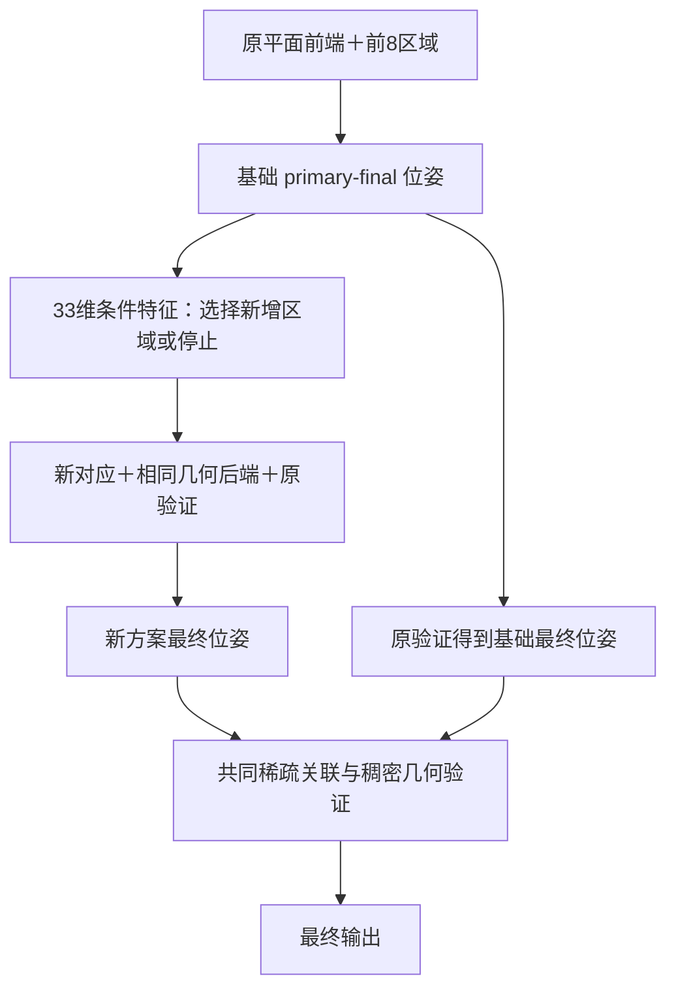

# 位姿条件区域价值与基础候选保留（2026-09-12）

## 本轮结论

取得了小幅、可复核的指标提升，但主要贡献来自保留基础候选并验证互补解，不是新增位姿特征已经学会了更好的区域价值。

最有证据支持的配置是 **native8最终位姿＋上轮19维风险模型备选＋共同验证**。相对原生8区域，平移均值0.758806→0.755181m、旋转均值1.975352→1.962270°，平移中位数0.144322→0.143109m、旋转中位数0.504232→0.490577°；25cm/2°召回82.6484%→83.7900%，10cm/1°与50cm/5°及更宽阈值保持原值。全部位姿有效。

平移均值改善约3.62mm；路线块bootstrap的5/10/20三种块长下，均值差区间均低于零，块长10为[-6.32,-1.25]mm。25cm召回提高1.14个百分点，但其区间下界为0；中位数改善区间跨零。不能把这称为已跨场景确认的大幅突破。最大单帧均值贡献约-0.62mm，未单独解释全部-3.62mm；仍有46.9m量级错误只小幅变小，不能称为困难帧已经正确恢复。

新增33维风险模型直接替换基础路径时没有形成整体改善；加入基础候选保留后虽然相对native8出现小幅同向改善，但同样保留机制下的19维控制有更低均值和更高25cm召回。33维严格召回29.2237%略高于19维的28.7671%，不足以抵消其它指标的取舍。因此本轮不支持“新增几何特征带来了独立整体收益”，也不支持“可学习地图单元没有意义”。

此前排序32精测仍有更高严格召回30.1370%和更低中位误差；本轮未叠加该精测，不能把不同配置最优列合成一个成绩。默认配置不升级，保留候选方案作为已完成全量验证的研究配置。

奖励模型直接输出存在无效位姿，候选保留后转为有限位姿；该查询基础解仍约17.25m/116.97°，这是避免无效输出，不是恢复正确定位。

## 下一步的具体优先级

1. 优先改善候选验证中的身份消歧。当前两候选集合仍有可用空间：33维风险两端点按冻结指数奖励做GT诊断，严格召回为32.88%，实际选择29.22%。这只说明现有解集合有互补性，不是预测器可达性的保证。需要共同测量和局部配置验证，不能仅依赖当前位姿自身的投影支持。
2. 若继续学区域价值，监督应包含最后选择阶段，并用建图训练路线检验候选增益是否可预测；必要时用多种子反事实区分稳定区域收益与求解扰动。当前留出相关性近零，继续只扩大特征维度缺乏依据。
3. 在上述固定合同下，再与原生排序32精测组合，并尽早做独立确认路线/场景。完整成本、联合区域边界/成员、真正地图压缩仍是未完成项，不能由本轮候选保留代替。

## 实验范围

本轮训练两个区域动作预测器，并完成五种配置的全部438查询定位/验证。原生91976原型、484上下文模式、123个6m物理区域保持固定。动作仍是从候选排名9–16中增加一块，或停在前8块；不是自由学习中心、边界、成员或地图存储。

全部指标覆盖438张反复使用的seq10/seq13开发查询；无效位姿计入总体，均值为∞时不以有限子集均值替代。新配置未叠加排序32精测，后者作为此前性能参考。

## 全量最终位姿指标

| 配置 | 平移均值m | 旋转均值° | 平移中位数m | 旋转中位数° | 10cm/1°召回% | 25cm/2°召回% | 50cm/5°召回% | 1m/10°召回% | 2m/45°召回% | 无效率% |
|---|---:|---:|---:|---:|---:|---:|---:|---:|---:|---:|
| 此前排序32精测 | 0.75857 | 1.97187 | 0.14176 | 0.48301 | 30.13699 | 82.64840 | 94.52055 | 96.34703 | 97.48858 | 0.00000 |
| 原生8区域 | 0.75881 | 1.97535 | 0.14432 | 0.50423 | 28.76712 | 82.64840 | 94.52055 | 96.34703 | 97.48858 | 0.00000 |
| 上轮19维风险选区 | 0.74242 | 1.96724 | 0.14252 | 0.49735 | 26.48402 | 82.87671 | 93.83562 | 96.11872 | 97.48858 | 0.00000 |
| 33维位姿条件奖励选区 | inf | inf | 0.14273 | 0.49639 | 28.08219 | 79.90868 | 94.06393 | 96.11872 | 97.94521 | 0.22831 |
| 33维位姿条件风险选区 | 0.75871 | 1.98156 | 0.14223 | 0.49824 | 27.62557 | 81.73516 | 94.29224 | 96.11872 | 97.48858 | 0.00000 |
| 保留8区域最终位姿＋奖励备选 | 0.75756 | 1.97171 | 0.14267 | 0.49466 | 29.22374 | 83.10502 | 94.29224 | 96.34703 | 97.48858 | 0.00000 |
| 保留8区域最终位姿＋风险备选 | 0.75711 | 1.96778 | 0.14311 | 0.49424 | 29.22374 | 82.87671 | 94.52055 | 96.34703 | 97.48858 | 0.00000 |
| 保留8区域最终位姿＋上轮19维风险备选 | 0.75518 | 1.96227 | 0.14311 | 0.49058 | 28.76712 | 83.78995 | 94.52055 | 96.34703 | 97.48858 | 0.00000 |

## 实现和监督合同

1. 新增14维几何状态特征，与原19维合成33维。基础原平面对应＋前8区域构成当前状态；在基础流程估计位姿下投影，使用粗token中心，检查独立token支持、候选正深度/残差、图像象限覆盖，以及真实1024行预算截断后增加或失去的几何支持。不是GT一致率，也不是子token精测误差。
2. 每个token最多一次支持票，多种3D解释取最佳有效残差。负深度和非有限投影不能贡献支持；空证据残差设为最大截断值；基础位姿无效时14维归零。用共享函数保证建图/查询定义一致。
3. 复用140×9个已冻结的混合前端四阶段反事实位姿。训练seq1/2/4/6共80张，留出seq7/8/11共60张；seq9继续因固定区域来源排除。新增特征使用同一路线arm0的primary-final估计位姿，不使用建图GT生成特征。查询使用native8 primary-final估计位姿。
4. 保持原ridge=0.1，对比指数奖励与对数位姿成本两种目标；没有根据本轮438查询结果调阈值或重新拟合。建图标签只用于拟合/离线评估，目标仍未包含最终稀疏/双稠密选择。模型训练仅路线留出，不等于底层几何/投影/坐标头或整个场景留出。
5. 后续候选保留对照不再训练：primary为native8最终选中位姿，alternate为本轮区域方案最终选中位姿。原公共两份稀疏对应不变，平面关联在保留的基础位姿处冻结；两个候选共同接受该关联及同一全有效query域稠密法向验证。原选择规则与阈值不变，两侧渲染按新计划重新执行；又给上轮19维风险模型施加完全相同的保留/验证机制，隔离新增14维特征与候选保留的贡献。这里保留了基础解，但验证仍可能选错，不能承诺逐查询不退步。
6. 渲染器增加显式consensus来源合同：核对两个原始端点的文件/内容哈希、名称、相机链路，以及每张选中位姿/usable与原端点精确一致。不能为最终选中位姿伪造一个PnP内点数；也不能用单份无关对应绕过相机来源检查。

## 建图留出与可学性诊断

以下留出集已参与多轮研究方向选择，不作为全新盲测。

| 配置 | 平移均值m | 旋转均值° | 平移中位数m | 旋转中位数° | 10cm/1°召回% | 25cm/2°召回% | 50cm/5°召回% |
|---|---:|---:|---:|---:|---:|---:|---:|
| 固定8区域 | 3.82530 | 6.56855 | 0.21981 | 0.52849 | 10.00000 | 55.00000 | 70.00000 |
| 33维奖励＋停止 | 4.79502 | 7.90892 | 0.20445 | 0.50551 | 13.33333 | 58.33333 | 70.00000 |
| 33维风险＋停止 | 3.93637 | 6.47876 | 0.20405 | 0.52849 | 5.00000 | 58.33333 | 70.00000 |
| 指数奖励GT上限，仅诊断 | 2.55396 | 4.90246 | 0.15073 | 0.35414 | 21.66667 | 65.00000 | 76.66667 |

候选间增益相关性按每张查询去均值后计算，仅为离线诊断：

| 特征/目标 | 训练相关性 | 留出相关性 | 留出选中平均效用增益 |
|---|---:|---:|---:|
| hybrid_reward | 0.12657 | 0.01520 | 0.01183 |
| hybrid_risk | 0.13169 | 0.01435 | 0.05890 |
| pose_reward | 0.16796 | 0.03733 | 0.00739 |
| pose_risk | 0.14754 | 0.00270 | 0.01535 |

奖励和风险的效用尺度不同，最后一列不可跨目标直接比较。几何支持有一定状态信息：留出基础误差≤0.25m时支持比例中位数约0.644，误差>1m时约0.275；但这不构成可靠的正确/错误判定阈值。两个33维模型的留出候选增益相关性仍接近零。

有限候选GT上限说明当前候选中仍有互补解；它不是运行时可实现性能，也不证明现有输入可预测这些收益。线性模型中对8个候选完全相同的基础状态特征，只能改变停止倾向，不能单独改变候选间排序；本轮实际的位姿条件排序主要来自候选投影支持及其变化。

## 配对不确定性

两条路线按帧顺序重组，循环块bootstrap 3000次，块长5/10/20；下表取10。无效位姿存在时，均值差仅公共有限子集条件统计，不能替代全量∞。区间不消除重复开发偏差。

| 新配置减参考 | 平移均值差m [95%CI] | 范围 | 10cm召回差pp [95%CI] |
|---|---|---|---|
| pose_reward_stop_vs_native8 | -0.01679 [-0.05931, 0.00732] | common-finite conditional ONLY | -0.685 [-4.338, 2.968] |
| pose_reward_stop_vs_risk_stop | -0.00036 [-0.03297, 0.03249] | common-finite conditional ONLY | 1.598 [-1.142, 4.795] |
| pose_reward_stop_vs_reliability_rank32 | -0.01655 [-0.06191, 0.00778] | common-finite conditional ONLY | -2.055 [-6.164, 1.826] |
| pose_risk_stop_vs_native8 | -0.00010 [-0.00625, 0.00693] | all queries | -1.142 [-3.881, 1.598] |
| pose_risk_stop_vs_risk_stop | 0.01629 [-0.00517, 0.05468] | all queries | 1.142 [-1.370, 3.653] |
| pose_risk_stop_vs_reliability_rank32 | 0.00014 [-0.00721, 0.00717] | all queries | -2.511 [-5.936, 0.913] |
| reward_retained_vs_native8 | -0.00125 [-0.00369, 0.00158] | all queries | 0.457 [-1.142, 2.055] |
| reward_retained_vs_risk_stop | 0.01514 [-0.00814, 0.05506] | all queries | 2.740 [-0.913, 6.164] |
| reward_retained_vs_reliability_rank32 | -0.00101 [-0.00573, 0.00365] | all queries | -0.913 [-4.338, 2.511] |
| risk_retained_vs_native8 | -0.00170 [-0.00379, 0.00017] | all queries | 0.457 [-0.913, 2.055] |
| risk_retained_vs_risk_stop | 0.01469 [-0.00882, 0.05488] | all queries | 2.740 [-0.685, 6.164] |
| risk_retained_vs_reliability_rank32 | -0.00146 [-0.00624, 0.00306] | all queries | -0.913 [-4.338, 2.055] |
| hybrid19_retained_vs_native8 | -0.00362 [-0.00632, -0.00125] | all queries | 0.000 [-1.598, 1.598] |
| hybrid19_retained_vs_risk_stop | 0.01276 [-0.01080, 0.05514] | all queries | 2.283 [-0.913, 5.479] |
| hybrid19_retained_vs_reliability_rank32 | -0.00339 [-0.00859, 0.00172] | all queries | -1.370 [-4.566, 1.598] |
| reward_retained_vs_pose_reward_stop | 0.01553 [-0.00842, 0.05848] | common-finite conditional ONLY | 1.142 [-1.826, 4.338] |
| risk_retained_vs_pose_risk_stop | -0.00160 [-0.00843, 0.00422] | all queries | 1.598 [-0.913, 4.110] |
| risk_retained_vs_hybrid19_retained | 0.00193 [0.00043, 0.00389] | all queries | 0.457 [-0.685, 1.826] |

## 正确性、成本与剩余问题

140张训练特征逐元素重算一致；两个模型重放完全一致，特征、基础位姿和反事实终点哈希绑定通过。全部新前端原对应前缀保持精确一致；每张最终输出都等于其冻结端点。奖励/风险方案停止时，最终位姿分别精确重放原生8区域结果；库存只有匹配分数最多3e-7浮点差异。

新增位姿条件功能需要先完成native8 primary-final估计，再搜索16个区域和重新求姿。停止返回8区域不等于节省16区域搜索成本。保留基础最终候选又增加一轮双候选验证；本轮不声称速度提升、同等总计算或完整RGB到pose延迟。完整CPU/GPU阶段时间保存在各protocol旁的timing.jsonl中。

运行中发现可选sampling-prior文件继承了旧“未读位姿”声明；本轮它依赖位姿条件下的选区，已修正声明并记录前后哈希。该可选prior没有进入任何本轮求解命令；已评测对应和位姿均未改动。

32项相关测试通过（12项选区/几何特征，15项渲染/来源校验，5项最终选择），包含负深度、重复token、预算挤掉旧支持、径向畸变与后端投影一致、相机替换/端点替换/已重签名伪造选择的拒绝。

仍未完成：最终验证选择进入区域价值监督；区域内联合身份/布局匹配；边界、成员和集合价值联合优化；自由生成/压缩地图单元；完全匹配真实计算成本；完整RGB到pose时延和峰值显存；独立新场景确认。因此不能声称附件建议全部落实或RADIO/MoGe能力已耗尽。

完整证据：native_pose_value_v294、native_pose_reward_v295、native_pose_risk_v295、native_pose_transfer_v296、native_pose_mainline_v297、native_pose_round_v298、native_pose_retention_v299。默认配置未修改。

